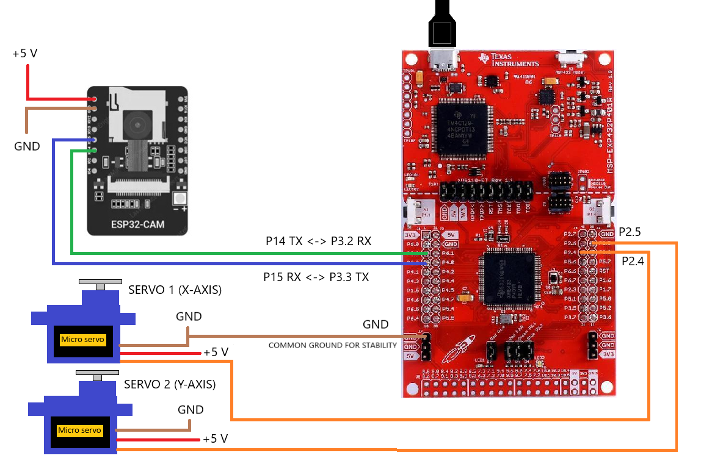

---


---
"Eyes Everywhere, Intelligence at Work." 👀🤖 </p>
Meet Smart Surveillance: an advanced motion-tracking system that detects movement, adjusts the camera automatically, and sends alerts via Telegram for real-time monitoring. <br>
Here is the completed Smart Surveillance system, ready for action!
<p align="center">  
  

---

## 🛠️ Main features
Smart Surveillance offers the following key features:
- Frame to frame motion detection
- GrayScale imaging for faster and more accurate processing
- Separation of frame using 3x3 grid to subdivide motion direction
- Motors centering the camera to the detected movement area
- Images are sent to a Telegram Bot  

<br>

## 📝 Requirements
To bring this project to life, we will need the following:

#### Hardware
- MSP432P401R Launchpad;
- ESP32 Cam;
- 2 SG90 or MS18 servos;
- Servo supports and ESP32 Cam mount;
- USB power supply for ESP32 Cam and USB cable for MSP432P401R;
- Jumper cables and breadboard (optional).

#### Software
##### IDE:
- Code Composer Studio for MSP432 Launchpad
- Arduino IDE for the ESP32 Cam
##### Libraries:
- stdio.h        
- stdlib.h       
- string.h
- stdint.h
- stdbool.h
- driverlib.h
- "esp_camera.h"         ESP32-CAM camera driver
- WiFi.h                 ESP32 wifi support
- HTTPClient.h           Library to easily make HTTP GET, POST and PUT requests to a web server
- WiFiClientSecure.h     Expands WiFi.h with SSL TLS secure connections

<br>

## 🎬 Get started
Clone the repository.

#### Schematic


#### How to build
1. Assemble the servo supports;
2. Connect the servos signal cable (orange) to pin 2.4 and 2.5 of MSP432P401R;
3. To power the servos, you can use the MSP432P401R's 5 V power supplies, or use an external power supply;
4. Use a USB adaptor to connect the 5 V and GND pins of ESP32 Cam, you can use pin 1 and 3 for debug (standart UART interface);
5. Connect pin 14 and pin 15 of ESP32 Cam to pin 3.2 (RX) and pin 3.3 (TX) of MSP432P401R, you connect a ground pin to the ESP32'ground for signal stability;
6. Attach the ESP32 Cam to the servo supports.

#### How to setup the firmware
1. Create a Telegram bot, get the bot token and the chat ID;
2. Clone the repository;
3. Download the ESP32 driver on Arduino IDE, if not already istalled;
4. In the config.h file change the ssid, password, bot token and chat token to your WiFi credentials and your bot credentials, make sure the Telegram certificate is still valid;
5. Upload the code to ESP32 Cam;
6. Connect the ESP32 Cam, follow the schematics (Having a common ground between MSP432P401R and ESP32 CAM improves serial communication reliability);
7. Build and upload the code to MSP432P401R.

#### How to burn
<br>
Once the firmware is loaded on the board, it is sufficient to provide power to it to run everything properly.

<br>

## 🧑‍💻 User guide
To fully harness the capabilities of the system, carefully explore this section! <br>
*TBD...(Inserire come l'utente usa Smart Surveillance una volta fatto partire... aggiunge anche note o problematiche a cui bisogna stare attenti)*
Make sure the cables do not disconnect while the servo turret is moving. Make sure the ESP32 Cam power supply is 5 V and at least 2 mA, because it is power hungry. 
Calibrate the ESP32 Cam motion threshold to the distance you expect the movement to be (run tests).


<br>

## 🔗 Demo
Get a better understanding of the project by checking out the following links! </p>
[]()
<br>
[![powerpoint_demo](https://img.shields.io/badge/Presentation-PowerPoint_Demo-red?style=for-the-badge&logo=data%3Aimage%2Fpng%3Bbase64%2CiVBORw0KGgoAAAANSUhEUgAAACAAAAAeCAMAAAB61OwbAAAABGdBTUEAALGPC%2FxhBQAAACBjSFJNAAB6JgAAgIQAAPoAAACA6AAAdTAAAOpgAAA6mAAAF3CculE8AAAC1lBMVEUAAAD%2FVVXuakjta0ftbEftbEftbEf%2Bjmr%2Fj2v%2Fj2v%2Fj2v%2FkGz%2FjnH%2FbUntbEbtbEf%2BjWn%2Fj2v%2Fj2r%2FjGbua0jta0f%2BjWn%2Fj2v%2Fj2v%2F%2FwDtbEftbEf9jWj%2Fj2r%2FmWbubEf9i2f%2Fj2v%2FgGDqa0b9i2f%2Fj2vPUDDLTSfJSye0Ryq3TjD%2FjmzLSij%2Fj2v%2FkGv%2Fjmz%2Fj2z5h2PTUjDTUi%2FTUjDUUS%2FRUjLSUjD%2FgADCPRzSUy%2FBPRvTUjDVVSu2NxLDPB6ZNyJwKxjTUjDTUTCaPCKgPiXSUS%2B4SinFTS3SUjDUUjDTUjDTUjDTUTHVVTPTUjHTUjDTUjDVUy7UUjDTUzHTUjDTUjDUUzH%2FAADGVTnVUjHSUjDSUjDTUjDSUjDTUy%2FUUTHZTTPtbEf%2Fj2vra0bsbEe4TTC4TS%2B4TC%2B3TC%2B3TC65UDLOXT7whGHKSyfJSifJSibJSSbJSSXISCXISCTIRyTIRiPHRiPHRSLHRCHFQyGVQCfmf17JSyfIRyPHRSPHRCLGQyHGQyDGQiCZPCPeelrJSCXGQh%2FFQR%2FSZ0vswbbswbXrvLDjpJPNWjvGQR%2FFQB6ZOyPWd17%2F%2F%2F%2F45uLwzcTz2dL%2F%2Fv39%2BPbPYETEPx3joZDdjnnmrZ%2FDPh3DPR2YOyLVdl3TblTquq7EPh3CPRzCPByYOiLGRCHVdVzos6XRZ0zUcVfx0cnYgWzBPBvAOxuWOSHZclL5h2PVdFz89%2FXhno3BOxvAOhu%2FORqOMBq5RyrTUjDVdFvnsqXQZUrNX0TERSXBPBy%2FOhq%2BOBmNLxnUc1vhn469Nxm9NxjTclrhno7AOhq%2BOBq8Nhi7NRiNLhnDPRzIUjTainfNYkm%2BORq8NRi7NRe6NBeMLhi9Nhi6Mxa5Mha7NBe6Mxe5Mxa4MRWKLBi3MBWvLxR6LRi6SCpxKxhwKxhwKhhwKhdwKxmINR%2B%2BSiugPiWlQCbQUS%2FFTS3GTS3RriagAAAAYnRSTlMAAzyMyOn65u3PnU4JB3Ho6%2FSQFErf7%2FBwAW%2F986gKk%2FfECG77qhBPVYz8b9GPTJrM%2BPnnw4c45QL9bKjdBg4RPPX8RUz6cWT6jzvp%2B24eqP7GNzWt9cBTAQlOiau7sZFeFPxldVgAAAABYktHRJPhA9%2B2AAAAB3RJTUUH6AcQCAUx9kAdBwAAAgxJREFUKM9jYEAARiZmFlY2dg5OLm4eBkzAy8efBAICyUAgKCSMLi8imgQBYslgIC4hiSIvJQ2VT5JJhgJZOSR5%2BSQ4UIApSFZUgssrp8BBqgpcQbIqyBY1dQ0NTa20dCDIyMzKys7JRShI1gYq0MnLLygsKi4pLSuvqKisrKquQVIgDvRLLUS6rqy%2BoqGysam5pRVJQbIuA0NBUVtxKUg7WLq9A1WBIA9DEVC6s6u7u6e3r7m5v2PCRBQFyXoMIMsnTZ4yddr0GTM7JkyYhaZAnwFk%2BqTJs5ua50yeO2HWvPkLUBUYMIDcvnDy7PaORZMXL5m3dNlyVAUcDBWVKxpXTl61es3ayeuWLlu%2FYeOmzcjAkAHk9i2TgWDrtqXrt%2B%2FYuWv3HmRgxADy2t7J%2B%2FYfOHho%2B47DO48cRVVgzNAO9NqxyceXLtu%2BASh94iSaAhMGkNdOTT69fsOZnWePnDh3%2FgKqAlMGoNcuXrp8ZcfOq0Dpa9dv3ERVYMYA9BrE8hO3zl2%2FcfsOqgJzCwZLoOVnQJafO3%2F33v07Dx6iKLBiYLCGWn7t7g2g9KPHT54iydvYAhOEnb29g%2BOz5y9egsGr128Q8k7OsCTn4voWBt69RyhwQyRad48PEPARSd4TOdl7ee9BAz6%2BqBnHzz8ART4wCCPvBYeEwl0XFh6BJXcyREZFx8TGxsUnJCLEALbUsiLiGNJpAAAAJXRFWHRkYXRlOmNyZWF0ZQAyMDI0LTA3LTE2VDA4OjA1OjQ5KzAwOjAwY8yPHgAAACV0RVh0ZGF0ZTptb2RpZnkAMjAyNC0wNy0xNlQwODowNTo0OSswMDowMBKRN6IAAAAASUVORK5CYII%3D&labelColor=grey)]()


<br>

## 📌 Project layout
Feel free to have a look at this layout to understand the full contents of the repository!
```
.
├──
├── 
├── README.md                           # Repository description file
├── LICENSE                             # MIT License
└──  imgs                               # Images used in README.md
      └── ...
```
*TBD...(Completare con il layout rimanente una volta concluso tutto la repository e il codice del progetto)*


<br>

## 🚀 About us
Currently, our development team is composed of:
|Name|Email|Contribution|
|--|--|--|
|🎩 Leonardo Chistè|leonardo.chiste@studenti.unitn.it|*TBD...(Completare con il contributo di Leonardo)*|
|🌟 Rayan Alessandro Tekaia|rayan.tekaia@studenti.unitn.it|*TBD...(Completare con il contributo di Rayan)*|
|🌟 Alberto Battistini|alberto.battistini@studenti.unitn.it|*TBD...(Completare con il contributo di Alberto)*|
|🌟 Saksham Bakshi|saksham.bakshi@studenti.unitn.it|*TBD...(Completare con il contributo di Sak)*|

If you have any feedback, please reach out to us. Of course, contributions are also always welcome!
