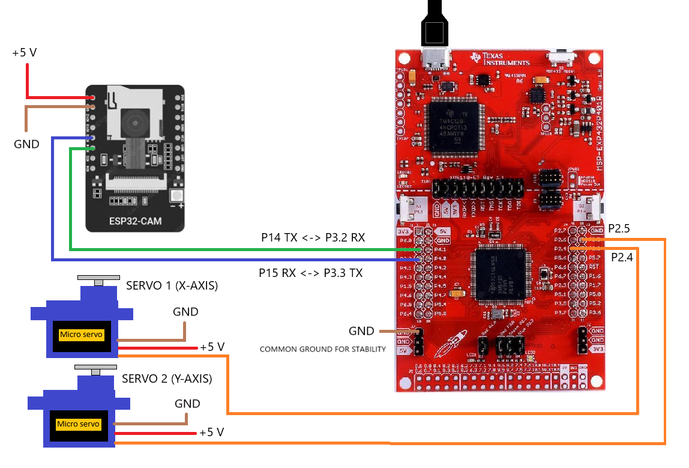

---


---
"Eyes Everywhere, Intelligence at Work." 👀🤖 </p>
Meet Smart Surveillance: a cutting-edge motion-tracking system that detects movement, auto-adjusts the camera, and delivers instant alerts via Telegram, keeping you informed in real time! <br>
Here is the completed Smart Surveillance system, ready for action! 

<p align="center"> <kbd>  </kbd>

---

## 🛠️ Main features
Smart Surveillance offers the following key features:
- **Software-Based Motion Detection:** Detects movement through frame-to-frame analysis
- **Grayscale Imaging:** Enhances processing speed and accuracy
- **3×3 Grid Analysis:** Subdivides frames to pinpoint motion direction
- **Automated Camera Adjustment:** Motors center the camera on detected movement
- **Instant Image Alerts:** Captures and sends images via a Telegram bot


<br>

## 📝 Requirements
To bring this project to life, we will need the following:

#### Hardware
- 1x TI MSP432P401R Launchpad
- 1x AI-Thinker ESP32 Cam
- 1x Programming module for ESP32 Cam
- 2x SG90 or MS18 servomotors
- 1x Pan-Tilt 2-axis servomotor support
- 1x ESP32 Cam mounting bracket
- 1x USB Power supply for ESP32 Cam & USB cable for MSP432P401R
- Jumper cables
- _(Optional) 1x Breadboard_ 

#### Software
##### IDE
- Code Composer Studio Integrated Development Environment (for MSP432 Launchpad)
- Arduino Integrated Development Environment (for ESP32 Cam)

##### Supporting libraries
- Standard libraries: <stdio.h> <stdlib.h> <string.h> <stdint.h> <stdbool.h>
- Camera driver: "esp_camera.h"
- Wi-Fi and Internet support libraries: <WiFi.h> <WiFiClientSecure.h> <HTTPClient.h>
- Hardware serial library for wiring: <HardwareSerial.h>
- MSP432 DriverLib: <ti/devices/msp432p4xx/driverlib/driverlib.h>


<br>

## 🎬 Get started
Embark on your journey to build and run your own system by following the steps outlined in this comprehensive guide!

#### Schematic
<p align="center"> <kbd>  </kbd>

#### How to build
1. Assemble the Pan-Tilt servo support alongside the ESP32-CAM mounting bracket for the main foundation
2. Carefully insert the servos into the support structure
3. Connect the servos to the MSP432 Launchpad (refer to the pinout in the schematic above)
4. Position the ESP32-CAM onto its mounting bracket and link it to the MSP432 Launchpad (pinout details provided in the schematic above)
5. Power the servos through either the MSP432 Launchpad’s +5V or an external power source
6. Supply power to the ESP32-CAM via a USB adapter and its USB cable
7. Ensure all ground connections (GND) are properly linked together to maintain signal integrity and system stability
8. Place the system in your desired location

#### How to setup the software
1. Clone this GitHub repo by using:
```
git clone https://github.com//PossumLiarR/Smart-Surveillance.git
```
2. Import `code/MSP432P401R_Smart_Surveillance`'s project in **Code Composer Studio IDE**
3. Go to: _Project → Properties → Build → Arm Compiler → Include Options_ and add the _source_ directory located in _simplelink_msp432p4_sdk_3_40_01_02/_
4. Go to: _Project → Properties → Build → Arm Linker → File Search Path_ and add:
   - _msp432p4xx_driverlib.lib_ directory located in _[..]/source/ti/devices/msp432p4xx/driverlib/ccs/_
   - _grlib.a_ located in _[..]/source/ti/grlib/lib/ccs/m4f/_
5. Import `code/ESP32CAM_Smart_Surveillance`'s project in **Arduino IDE**
6. Download any remaining libraries in both IDEs, if not already installed
7. Open up **Telegram**, create a Telegram Bot and take note of its token and chat ID
8. Open the config.h file and insert the bot token and the chat ID
9. Insert the ssid and password values of a nearby detectable Wi-Fi connection in the same file
10. In the same file check if the Telegram SSL certificate is still valid: if not, replace it with a new one
11. Build and run the project on CCS to load the software on the MSP432   
12. Gently detach the ESP32 Cam from its support, connect it to the programming module, upload the Arduino code on it and reposition the camera back into place.

#### How to burn
Once the firmware is loaded on both boards, it is sufficient to provide power to them to run everything properly.


<br>

## 🧑‍💻 User guide
To fully harness the capabilities of the system, carefully explore this section! <br>

#### Workflow
<p align="center"> <kbd>  </kbd>


#### Extra notes
- Ensure the cables remain securely connected while the servo turret is in motion. While this is generally not an issue if the cables are properly secured, sudden, sharp camera movements may cause disconnections. To prevent excessive camera movement, especially in a budget-friendly setup like ours, consider using tape to keep the camera in place
- Ensure the ESP32-CAM power supply provides +5V with at least 2mA current. The board is relatively power-hungry as it remains active continuously, never entering sleep mode, in order to constantly detect motion
- Play around with the motion constants (MOTION_THRESHOLD and MIN_PIXEL_CHANGE) to fine-tune the system for your specific setup! The MOTION_THRESHOLD determines the minimum difference required between two pixels for them to be classified as different. As a general rule, you'll want to set this higher in brighter environments, where more fluctuation occurs, and lower in darker settings. The MIN_PIXEL_CHANGE defines how many pixels need to differ for the system to register motion. We’ve set it to 3000 (approximately 4% of the frame's pixels), but feel free to adjust it: use a higher value for a more rigid system or a lower one for a more lenient approach


<br>

## 🔗 Demo
Get a better understanding of the project by checking out the following links! </p>
[]()
<br>
[![powerpoint_demo](https://img.shields.io/badge/Presentation-PowerPoint_Demo-red?style=for-the-badge&logo=data%3Aimage%2Fpng%3Bbase64%2CiVBORw0KGgoAAAANSUhEUgAAACAAAAAeCAMAAAB61OwbAAAABGdBTUEAALGPC%2FxhBQAAACBjSFJNAAB6JgAAgIQAAPoAAACA6AAAdTAAAOpgAAA6mAAAF3CculE8AAAC1lBMVEUAAAD%2FVVXuakjta0ftbEftbEftbEf%2Bjmr%2Fj2v%2Fj2v%2Fj2v%2FkGz%2FjnH%2FbUntbEbtbEf%2BjWn%2Fj2v%2Fj2r%2FjGbua0jta0f%2BjWn%2Fj2v%2Fj2v%2F%2FwDtbEftbEf9jWj%2Fj2r%2FmWbubEf9i2f%2Fj2v%2FgGDqa0b9i2f%2Fj2vPUDDLTSfJSye0Ryq3TjD%2FjmzLSij%2Fj2v%2FkGv%2Fjmz%2Fj2z5h2PTUjDTUi%2FTUjDUUS%2FRUjLSUjD%2FgADCPRzSUy%2FBPRvTUjDVVSu2NxLDPB6ZNyJwKxjTUjDTUTCaPCKgPiXSUS%2B4SinFTS3SUjDUUjDTUjDTUjDTUTHVVTPTUjHTUjDTUjDVUy7UUjDTUzHTUjDTUjDUUzH%2FAADGVTnVUjHSUjDSUjDTUjDSUjDTUy%2FUUTHZTTPtbEf%2Fj2vra0bsbEe4TTC4TS%2B4TC%2B3TC%2B3TC65UDLOXT7whGHKSyfJSifJSibJSSbJSSXISCXISCTIRyTIRiPHRiPHRSLHRCHFQyGVQCfmf17JSyfIRyPHRSPHRCLGQyHGQyDGQiCZPCPeelrJSCXGQh%2FFQR%2FSZ0vswbbswbXrvLDjpJPNWjvGQR%2FFQB6ZOyPWd17%2F%2F%2F%2F45uLwzcTz2dL%2F%2Fv39%2BPbPYETEPx3joZDdjnnmrZ%2FDPh3DPR2YOyLVdl3TblTquq7EPh3CPRzCPByYOiLGRCHVdVzos6XRZ0zUcVfx0cnYgWzBPBvAOxuWOSHZclL5h2PVdFz89%2FXhno3BOxvAOhu%2FORqOMBq5RyrTUjDVdFvnsqXQZUrNX0TERSXBPBy%2FOhq%2BOBmNLxnUc1vhn469Nxm9NxjTclrhno7AOhq%2BOBq8Nhi7NRiNLhnDPRzIUjTainfNYkm%2BORq8NRi7NRe6NBeMLhi9Nhi6Mxa5Mha7NBe6Mxe5Mxa4MRWKLBi3MBWvLxR6LRi6SCpxKxhwKxhwKhhwKhdwKxmINR%2B%2BSiugPiWlQCbQUS%2FFTS3GTS3RriagAAAAYnRSTlMAAzyMyOn65u3PnU4JB3Ho6%2FSQFErf7%2FBwAW%2F986gKk%2FfECG77qhBPVYz8b9GPTJrM%2BPnnw4c45QL9bKjdBg4RPPX8RUz6cWT6jzvp%2B24eqP7GNzWt9cBTAQlOiau7sZFeFPxldVgAAAABYktHRJPhA9%2B2AAAAB3RJTUUH6AcQCAUx9kAdBwAAAgxJREFUKM9jYEAARiZmFlY2dg5OLm4eBkzAy8efBAICyUAgKCSMLi8imgQBYslgIC4hiSIvJQ2VT5JJhgJZOSR5%2BSQ4UIApSFZUgssrp8BBqgpcQbIqyBY1dQ0NTa20dCDIyMzKys7JRShI1gYq0MnLLygsKi4pLSuvqKisrKquQVIgDvRLLUS6rqy%2BoqGysam5pRVJQbIuA0NBUVtxKUg7WLq9A1WBIA9DEVC6s6u7u6e3r7m5v2PCRBQFyXoMIMsnTZ4yddr0GTM7JkyYhaZAnwFk%2BqTJs5ua50yeO2HWvPkLUBUYMIDcvnDy7PaORZMXL5m3dNlyVAUcDBWVKxpXTl61es3ayeuWLlu%2FYeOmzcjAkAHk9i2TgWDrtqXrt%2B%2FYuWv3HmRgxADy2t7J%2B%2FYfOHho%2B47DO48cRVVgzNAO9NqxyceXLtu%2BASh94iSaAhMGkNdOTT69fsOZnWePnDh3%2FgKqAlMGoNcuXrp8ZcfOq0Dpa9dv3ERVYMYA9BrE8hO3zl2%2FcfsOqgJzCwZLoOVnQJafO3%2F33v07Dx6iKLBiYLCGWn7t7g2g9KPHT54iydvYAhOEnb29g%2BOz5y9egsGr128Q8k7OsCTn4voWBt69RyhwQyRad48PEPARSd4TOdl7ee9BAz6%2BqBnHzz8ART4wCCPvBYeEwl0XFh6BJXcyREZFx8TGxsUnJCLEALbUsiLiGNJpAAAAJXRFWHRkYXRlOmNyZWF0ZQAyMDI0LTA3LTE2VDA4OjA1OjQ5KzAwOjAwY8yPHgAAACV0RVh0ZGF0ZTptb2RpZnkAMjAyNC0wNy0xNlQwODowNTo0OSswMDowMBKRN6IAAAAASUVORK5CYII%3D&labelColor=grey)]()


<br>

## 📌 Project layout
Feel free to have a look at this layout to understand the full contents of the repository!
```
.
├── code
│   ├── ESP32CAM_Smart_Surveillance              # Arduino source code
│   │   ├── ESP32CAM_Smart_Surveillance.ino      # Arduino: main
│   │   └── config.h                             # Arduino: configuration_library
│   └── MSP432P401R_Smart_Surveillance           # CCS source code
│       ├── main.c                               # CCS: main
│       └── ...
├── Smart_Surveillance_Presentation.pptx         # Presentation slides                                 
├── README.md                                    # Repository description file
├── LICENSE                                      # MIT License
└──  imgs                                        # Images used in README.md
      └── ...
```


<br>

## 🚀 About us
Currently, our development team is composed of:
|Name|Email|Contribution|
|--|--|--|
|🎩 Leonardo Chistè|leonardo.chiste@studenti.unitn.it|*TBD...(Completare con il contributo di Leonardo)*|
|🌟 Rayan Alessandro Tekaia|rayan.tekaia@studenti.unitn.it|*TBD...(Completare con il contributo di Rayan)*|
|🌟 Alberto Battistini|alberto.battistini@studenti.unitn.it|*TBD...(Completare con il contributo di Alberto)*|
|🌟 Saksham Bakshi|saksham.bakshi@studenti.unitn.it|*TBD...(Completare con il contributo di Sak)*|

If you have any feedback, please reach out to us. Of course, contributions are also always welcome!
