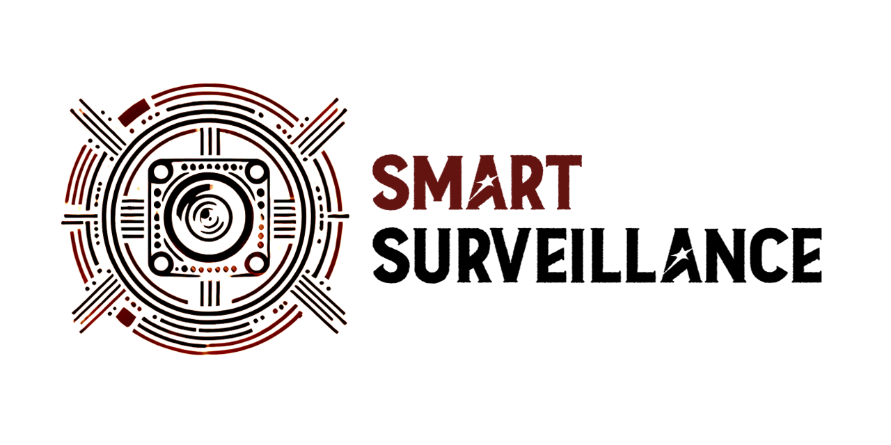

<p align="center">
  

---
"Eyes Everywhere, Intelligence at Work." 👀🤖 </p>
Meet Smart Surveillance: *TBD...(Sommario dove si descrive super fast cos'è e cosa fa il progetto)* </p>
Here is the completed Smart Surveillance system, ready for action!
<p align="center">  
  

---

## 🛠️ Main features
The most important features of Smart Surveillance are:
- *TBD...(Inserire le caratteristiche principali del sistema, ho messo tipo degli esempi a caso da cambiare per rendere un pò l'idea)*
- Yolo motion detection for this ecc...
- Possibility to do this ecc...
- Real-time readings for this ecc...

## 🔗 Demo
Get a better understanding of the project by checking out the following links! </p>
[]()
</p>

[![powerpoint_demo](https://img.shields.io/badge/Presentation-PowerPoint_Demo-red?style=for-the-badge&logo=data%3Aimage%2Fpng%3Bbase64%2CiVBORw0KGgoAAAANSUhEUgAAACAAAAAeCAMAAAB61OwbAAAABGdBTUEAALGPC%2FxhBQAAACBjSFJNAAB6JgAAgIQAAPoAAACA6AAAdTAAAOpgAAA6mAAAF3CculE8AAAC1lBMVEUAAAD%2FVVXuakjta0ftbEftbEftbEf%2Bjmr%2Fj2v%2Fj2v%2Fj2v%2FkGz%2FjnH%2FbUntbEbtbEf%2BjWn%2Fj2v%2Fj2r%2FjGbua0jta0f%2BjWn%2Fj2v%2Fj2v%2F%2FwDtbEftbEf9jWj%2Fj2r%2FmWbubEf9i2f%2Fj2v%2FgGDqa0b9i2f%2Fj2vPUDDLTSfJSye0Ryq3TjD%2FjmzLSij%2Fj2v%2FkGv%2Fjmz%2Fj2z5h2PTUjDTUi%2FTUjDUUS%2FRUjLSUjD%2FgADCPRzSUy%2FBPRvTUjDVVSu2NxLDPB6ZNyJwKxjTUjDTUTCaPCKgPiXSUS%2B4SinFTS3SUjDUUjDTUjDTUjDTUTHVVTPTUjHTUjDTUjDVUy7UUjDTUzHTUjDTUjDUUzH%2FAADGVTnVUjHSUjDSUjDTUjDSUjDTUy%2FUUTHZTTPtbEf%2Fj2vra0bsbEe4TTC4TS%2B4TC%2B3TC%2B3TC65UDLOXT7whGHKSyfJSifJSibJSSbJSSXISCXISCTIRyTIRiPHRiPHRSLHRCHFQyGVQCfmf17JSyfIRyPHRSPHRCLGQyHGQyDGQiCZPCPeelrJSCXGQh%2FFQR%2FSZ0vswbbswbXrvLDjpJPNWjvGQR%2FFQB6ZOyPWd17%2F%2F%2F%2F45uLwzcTz2dL%2F%2Fv39%2BPbPYETEPx3joZDdjnnmrZ%2FDPh3DPR2YOyLVdl3TblTquq7EPh3CPRzCPByYOiLGRCHVdVzos6XRZ0zUcVfx0cnYgWzBPBvAOxuWOSHZclL5h2PVdFz89%2FXhno3BOxvAOhu%2FORqOMBq5RyrTUjDVdFvnsqXQZUrNX0TERSXBPBy%2FOhq%2BOBmNLxnUc1vhn469Nxm9NxjTclrhno7AOhq%2BOBq8Nhi7NRiNLhnDPRzIUjTainfNYkm%2BORq8NRi7NRe6NBeMLhi9Nhi6Mxa5Mha7NBe6Mxe5Mxa4MRWKLBi3MBWvLxR6LRi6SCpxKxhwKxhwKhhwKhdwKxmINR%2B%2BSiugPiWlQCbQUS%2FFTS3GTS3RriagAAAAYnRSTlMAAzyMyOn65u3PnU4JB3Ho6%2FSQFErf7%2FBwAW%2F986gKk%2FfECG77qhBPVYz8b9GPTJrM%2BPnnw4c45QL9bKjdBg4RPPX8RUz6cWT6jzvp%2B24eqP7GNzWt9cBTAQlOiau7sZFeFPxldVgAAAABYktHRJPhA9%2B2AAAAB3RJTUUH6AcQCAUx9kAdBwAAAgxJREFUKM9jYEAARiZmFlY2dg5OLm4eBkzAy8efBAICyUAgKCSMLi8imgQBYslgIC4hiSIvJQ2VT5JJhgJZOSR5%2BSQ4UIApSFZUgssrp8BBqgpcQbIqyBY1dQ0NTa20dCDIyMzKys7JRShI1gYq0MnLLygsKi4pLSuvqKisrKquQVIgDvRLLUS6rqy%2BoqGysam5pRVJQbIuA0NBUVtxKUg7WLq9A1WBIA9DEVC6s6u7u6e3r7m5v2PCRBQFyXoMIMsnTZ4yddr0GTM7JkyYhaZAnwFk%2BqTJs5ua50yeO2HWvPkLUBUYMIDcvnDy7PaORZMXL5m3dNlyVAUcDBWVKxpXTl61es3ayeuWLlu%2FYeOmzcjAkAHk9i2TgWDrtqXrt%2B%2FYuWv3HmRgxADy2t7J%2B%2FYfOHho%2B47DO48cRVVgzNAO9NqxyceXLtu%2BASh94iSaAhMGkNdOTT69fsOZnWePnDh3%2FgKqAlMGoNcuXrp8ZcfOq0Dpa9dv3ERVYMYA9BrE8hO3zl2%2FcfsOqgJzCwZLoOVnQJafO3%2F33v07Dx6iKLBiYLCGWn7t7g2g9KPHT54iydvYAhOEnb29g%2BOz5y9egsGr128Q8k7OsCTn4voWBt69RyhwQyRad48PEPARSd4TOdl7ee9BAz6%2BqBnHzz8ART4wCCPvBYeEwl0XFh6BJXcyREZFx8TGxsUnJCLEALbUsiLiGNJpAAAAJXRFWHRkYXRlOmNyZWF0ZQAyMDI0LTA3LTE2VDA4OjA1OjQ5KzAwOjAwY8yPHgAAACV0RVh0ZGF0ZTptb2RpZnkAMjAyNC0wNy0xNlQwODowNTo0OSswMDowMBKRN6IAAAAASUVORK5CYII%3D&labelColor=grey)]() </p>
*TBD...(Inserire un link per il video yt e per il pptx tra parentesi finali)*

## 📝 Project layout
Follow this layout to understand all the contents of the repository!
```
.
├──
├── 
├── README.md                           # Repository description file
├── LICENSE                             # MIT License
└──  imgs                               # Images used in README.md
      └── ...
```
*TBD...(Completare con il layout rimanente una volta concluso tutto la repository e il codice del progetto)*

## 🚀 About us
Currently our developer's team is composed by:
|Name|Email|Contribution|
|--|--|--|
|🎩 Leonardo Chistè|leonardo.chiste@studenti.unitn.it|*TBD...(Completare con il contributo di Leonardo)*|
|🌟 Rayan Alessandro Tekaia|rayan.tekaia@studenti.unitn.it|*TBD...(Completare con il contributo di Rayan)*|
|🌟 Alberto Battistini|alberto.battistini@studenti.unitn.it|*TBD...(Completare con il contributo di Alberto)*|
|🌟 Saksham Bakshi|saksham.bakshi@studenti.unitn.it|*TBD...(Completare con il contributo di Sak)*|

If you have any feedback, please reach us out. Of course, contributions are also always welcome!
